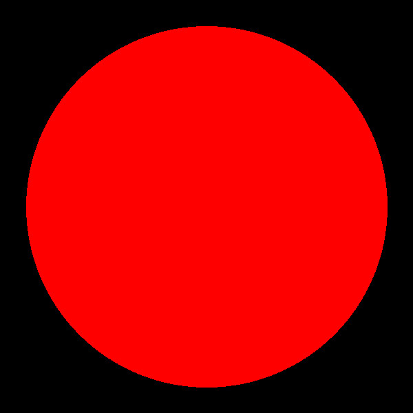
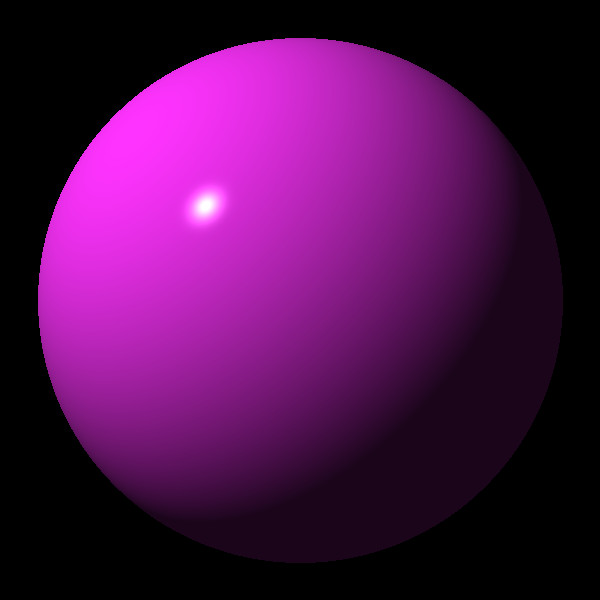
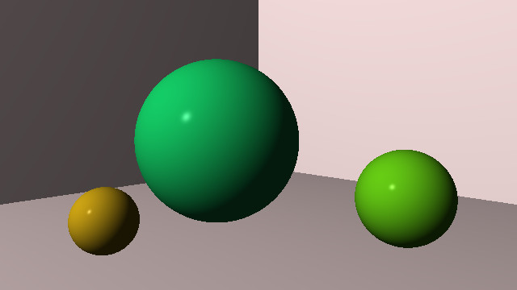
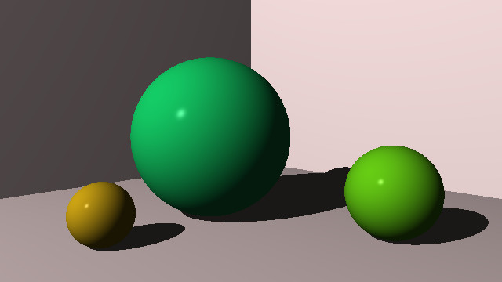
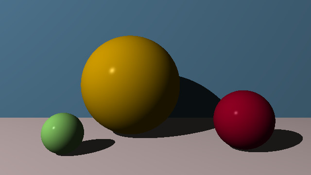
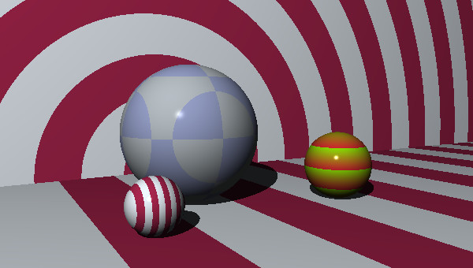

# JavaScript - Ray Tracer Challenge

My implementation, in javascript, of the code for the book:

[The Ray Tracer Challenge](https://pragprog.com/book/jbtracer/the-ray-tracer-challenge)  
A Test-Driven Guide to Your First 3D Renderer  
by [Jamis Buck](https://github.com/jamis)

    
Chapter 02

    

    
Chapter 04

    

    
Chapter 05

    

    
Chapter 06

    

    
Chapter 07

    

    
Chapter 08

    

    
Chapter 09

    

    
Chapter 10

    

